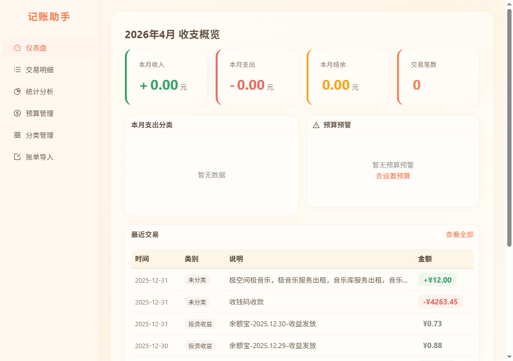
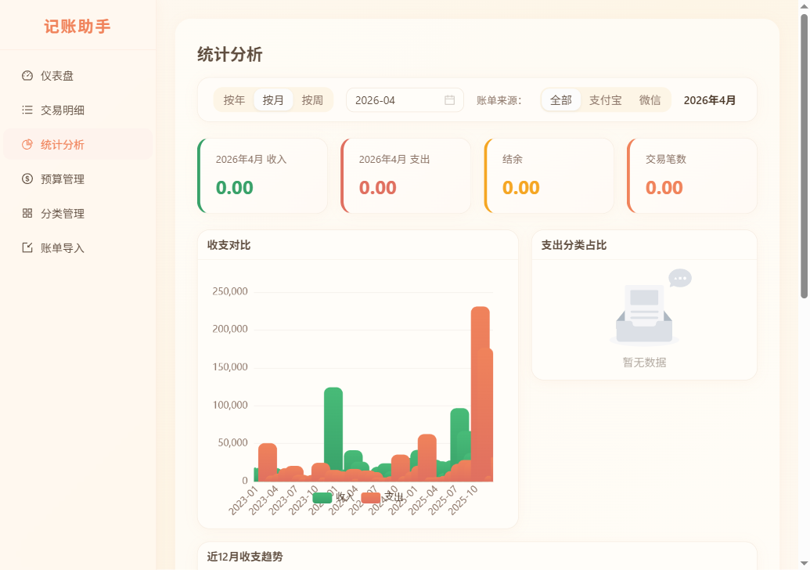
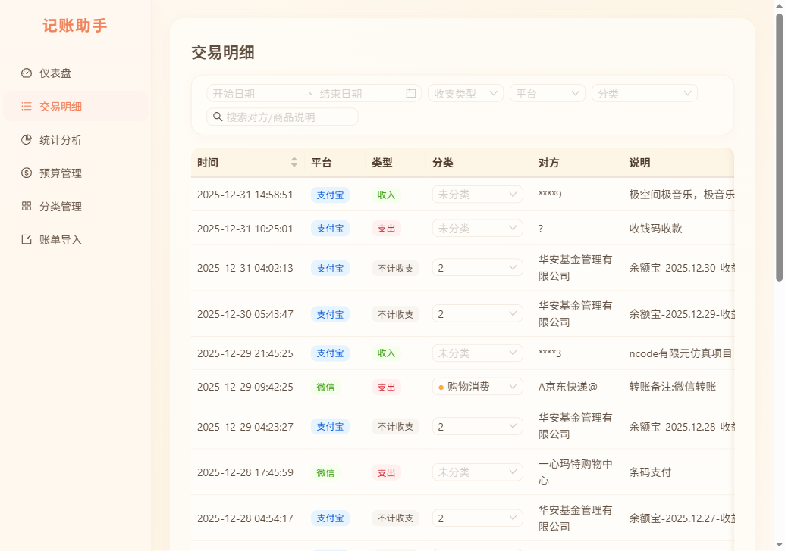
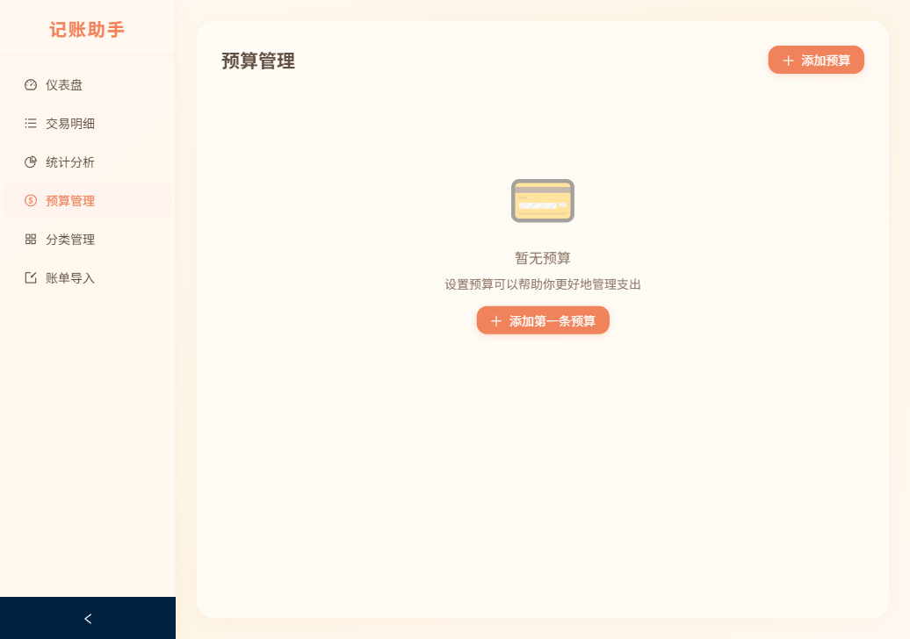

<div align="center">
  <h1>📒 记账 App</h1>
  <p><em>你的每一笔，都值得被温柔记录</em></p>

  
  
  
  
  
  
</div>

---

## ✨ 这是什么？

一个**全栈个人记账应用**，帮你轻松管理每一笔收支。支持微信和支付宝账单一键导入，自动分类，预算预警，还有漂亮的图表帮你看清钱都去哪了。

> 设计理念：**记账不该是苦差事**。暖橙色调 + 圆润 UI，让每一次记账都有温度。

---

## 🖼️ 预览

<div align="center">
  
  &nbsp;
  
  <br /><br />
  
  &nbsp;
  
</div>

---

## 🚀 功能一览

| 模块 | 功能 |
|------|------|
| 📊 **仪表盘** | 收支总览、月度趋势、分类排名、预算健康度一眼看清 |
| 💰 **交易管理** | 支持筛选、搜索、分页，按分类 / 日期 / 金额灵活查阅 |
| 📈 **统计分析** | 按周/月/年汇总，分类饼图，趋势折线图，日历热力图全都有 |
| 📥 **账单导入** | 一键上传微信或支付宝账单，自动解析、智能去重 |
| 🏷️ **自动分类** | 基于规则引擎自动归类交易，支持"包含/精确/正则"三种匹配模式 |
| 🎯 **预算管理** | 按年/月/周设置预算，超 80% 自动预警 |
| 👥 **多用户** | JWT 认证，每个用户独立数据，支持管理员角色 |

---

## 🧱 技术栈

### 前端

| 技术 | 用途 |
|------|------|
| **React 19** | UI 框架 |
| **TypeScript 6** | 类型安全 |
| **Vite 8** | 构建工具 |
| **Ant Design 6** | 组件库，暖橙自定义主题 |
| **ECharts 6** | 数据可视化（饼图、折线图、日历热力图） |
| **React Router 7** | 客户端路由 |
| **TanStack Query 5** | 服务端状态管理 |
| **Axios** | HTTP 请求 |

### 后端

| 技术 | 用途 |
|------|------|
| **FastAPI** | 高性能异步 Python Web 框架 |
| **SQLAlchemy 2** | ORM，模型驱动建表 |
| **SQLite** | 零配置嵌入式数据库 |
| **Pandas + openpyxl** | 账单文件解析引擎 |
| **JWT** | 无状态用户认证 |

---

## 🏗️ 项目结构

```
jizhangapp/
├── frontend/                  # React 前端
│   ├── src/
│   │   ├── api/               # API 请求层
│   │   ├── components/        # 通用组件
│   │   ├── hooks/             # 自定义 Hooks
│   │   ├── pages/             # 页面组件（7 个页面）
│   │   ├── types/             # TypeScript 类型定义
│   │   └── utils/             # 工具函数
│   └── package.json
├── backend/                   # FastAPI 后端
│   ├── app/
│   │   ├── routers/           # API 路由（6 个模块）
│   │   ├── services/          # 业务逻辑层
│   │   ├── models.py          # 数据模型（6 张表）
│   │   └── auth.py            # JWT 认证
│   └── requirements.txt
└── docs/                      # 设计文档
```

---

## ⚡ 快速开始

### 环境要求

- **Python** ≥ 3.11
- **Node.js** ≥ 20

### 1. 克隆项目

```bash
git clone https://github.com/KYCHENCKY/jizhangapp.git
cd jizhangapp
```

### 2. 启动后端

```bash
cd backend
pip install -r requirements.txt
python -m uvicorn app.main:app --host 0.0.0.0 --port 8000 --reload
```

后端启动后访问 [http://localhost:8000/docs](http://localhost:8000/docs) 查看 Swagger API 文档。

### 3. 启动前端

```bash
cd frontend
npm install
npm run dev
```

浏览器打开 [http://localhost:5173](http://localhost:5173)，注册账号即可开始使用。

### 4. 导入账单数据

进入「导入」页面，上传微信或支付宝导出的账单文件（CSV / XLSX），系统会自动解析、去重并智能分类。

---

## 🔗 API 接口

| 路由 | 描述 |
|------|------|
| `POST /api/auth/register` | 用户注册 |
| `POST /api/auth/login` | 用户登录 |
| `GET /api/transactions` | 交易列表（分页 + 筛选） |
| `POST /api/upload/wechat` | 上传微信账单 |
| `POST /api/upload/alipay` | 上传支付宝账单 |
| `GET /api/statistics/summary` | 收支汇总 |
| `GET /api/statistics/by-category` | 分类统计 |
| `GET /api/statistics/trend` | 趋势数据 |
| `GET /api/statistics/daily` | 每日明细（日历热力图） |
| `GET /api/categories` | 分类管理 CRUD |
| `GET /api/budgets` | 预算管理 CRUD |
| `GET /api/budgets/alerts` | 预算预警 |

---

## 🎨 设计特色

主题色调选用了**暖橙色** (`#f0835b`) —— 不像传统记账应用那样冷冰冰的数字罗列，而是一种让人安心的温度感。圆角卡片、柔和阴影、奶油色背景，让每次打开都像翻开一本温暖的手账。

---

## 📄 License

MIT — 自由使用，记账自由。
